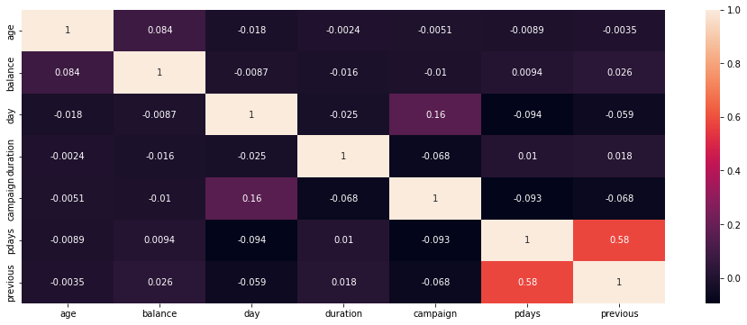
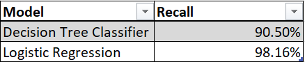
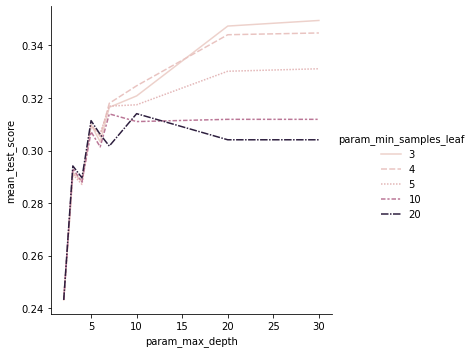
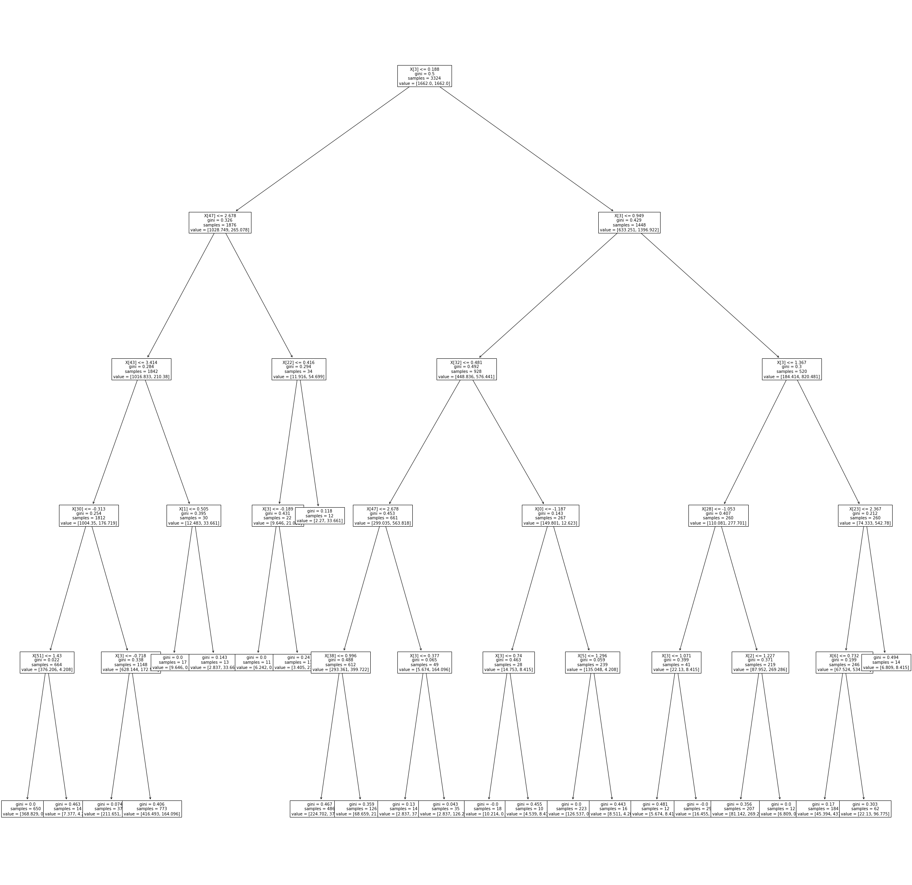
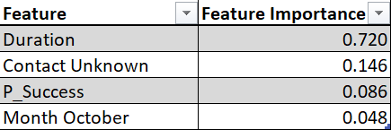
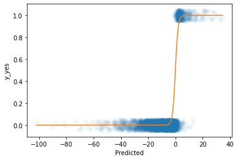

# Predicting If a Client Will Subscribe to A Portuguese Banking Campaign

 

Badge [source](https://shields.io/)

## Key findings

The bank is more likely to get clients to subcribe to its bank term deposit if it is able to increase its duration of phone calls with them, furthermore, unknown clients who have not been previously contacted have a higher propensity to subcribe. 

## Authors

- [@siyamabu](https://www.github.com/siyamabu)

**Language and Tools:** 
* Python :snake:
* Jupyter Notebook :notebook:
* GitHub :heart_eyes:

**Libraries used:** 
* Pandas
* Scikit-learn
* Numpy
* Matplotlib
* Seaborn

**Environments Used:** 
* Windows 10 🪟

## Table of Contents

  - [Motivation](#motivation)
  - [Data source](#data-source)
  - [Methods](#methods)
  - [Quick Glance at the Results](#quick-glance-at-the-results)
  - [Lessons Learned and Recommendations](#lessons-learned-and-recommendations)
  - [Limitations and What Can Be Improved](#limitations-and-what-can-be-improved)
  - [Explore the Notebook](#explore-the-notebook)
  - [License](#license)

## Motivation 

I created this project as a means to gain information to aid my cousin in her marketing efforts to get current and potential customers to subcribe to her curated pet kit service. She intended to administer a marketing campaign centered around phone calls, thus, I wanted to understand how she could be more effective in getting them to subscribe to her service. 

## Data Source

- [Bank Marketing Campaign](https://archive.ics.uci.edu/ml/datasets/Bank+Marketing)

## Dataset Description

The data is related with direct marketing campaigns of a Portuguese banking institution. The marketing campaigns were based on phone calls. Often, more than one contact to the same client was required, in order to assess if the product (bank term deposit) would be ('yes') or not ('no') subscribed. The classification goal is to predict if the client will subscribe (yes/no) a term deposit.

## Methods

1. Exploratory Data Analysis
    * Historgrams of each quantitative feature and an assessment of correlations between pairs of quantitative features. 
    * Value counts table of each qualitative feature. 
2. Data Cleaning
    * An analysis on the extent of missing values for each feature coupled with a missing value imputation using the median. 
    * Transformation of highly skewed quanitative features using a box cox transformation. 
    * One-Hot encoding of qualitative features. 
3. Decision Tree Classifier
   * First Tree using max_depth=3 and min_samples_leaf=5.
      * 5 Fold Cross Validation
   * Second Tree using max_depth=5 and min_samples_leaf=10.
      * 5 Fold Cross Validation
   * Third Tree using GridSearchCV to find a more optimal tree.
      * 5 Fold Cross Validation.
4. Logistic Regression 
   * First Model using transformed and one-hot encode features.
   * Second Model where the transformed features are standardized and polynomial features with degree=2 are added. 
   * 5 Fold Cross Validation

## Quick Glance at the Results

Correlations between variables.

A comparison of the best results from each model.

GridSearchCV Results.

 

The optimal tree from GridSearchCV.

4 highest feature importance scores from the best decision tree model.

 

Polynomial coefficient estimates. 

Sigmoid Curve 

## Lessons Learned and Recommendations
- The phone call duration is the most significant feature in predicting if a client will subcribe to the bank term deposit. This makes sense because how long the call lasts for is indicative to if the message was communicated to the client and the deal being closed upon the client understanding the goals of the campaign in the first place. 
- Unknown clients seem to have a higher propensity to subcribe to the bank term deposits. It may be more effective for the bank to target new clients or implement a limit of three phonecall per client to make their marketing campaign more effective. 

## Limitations and What Can Be Improved
-  This project soley focuses on recall as a performance measure  it may be more effective to compare recall with precision or F-1 Score. 
-  Retraining the model without the least significant features.

## Explore the Notebook

To explore the notebook file [here](https://github.com/siyamabu/Portuguese-Banking-Campaign/blob/main/portuguese_banking_campaign.ipynb)

## License

MIT License

Copyright (c) 2022 Siyabonga Mabuza

Permission is hereby granted, free of charge, to any person obtaining a copy
of this software and associated documentation files (the "Software"), to deal
in the Software without restriction, including without limitation the rights
to use, copy, modify, merge, publish, distribute, sublicense, and/or sell
copies of the Software, and to permit persons to whom the Software is
furnished to do so, subject to the following conditions:

The above copyright notice and this permission notice shall be included in all
copies or substantial portions of the Software.

THE SOFTWARE IS PROVIDED "AS IS", WITHOUT WARRANTY OF ANY KIND, EXPRESS OR
IMPLIED, INCLUDING BUT NOT LIMITED TO THE WARRANTIES OF MERCHANTABILITY,
FITNESS FOR A PARTICULAR PURPOSE AND NONINFRINGEMENT. IN NO EVENT SHALL THE
AUTHORS OR COPYRIGHT HOLDERS BE LIABLE FOR ANY CLAIM, DAMAGES OR OTHER
LIABILITY, WHETHER IN AN ACTION OF CONTRACT, TORT OR OTHERWISE, ARISING FROM,
OUT OF OR IN CONNECTION WITH THE SOFTWARE OR THE USE OR OTHER DEALINGS IN THE
SOFTWARE.

Learn more about [MIT](https://choosealicense.com/licenses/mit/) license

